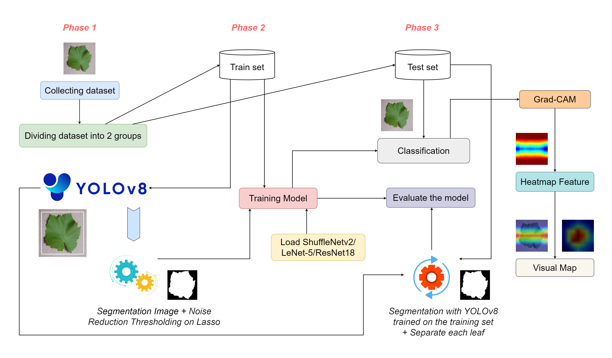
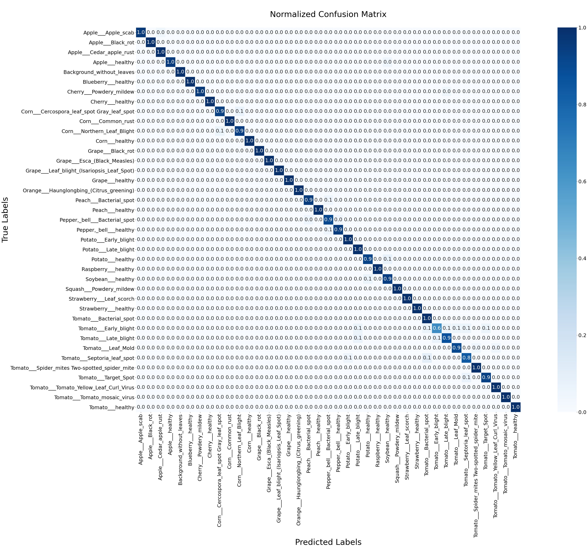
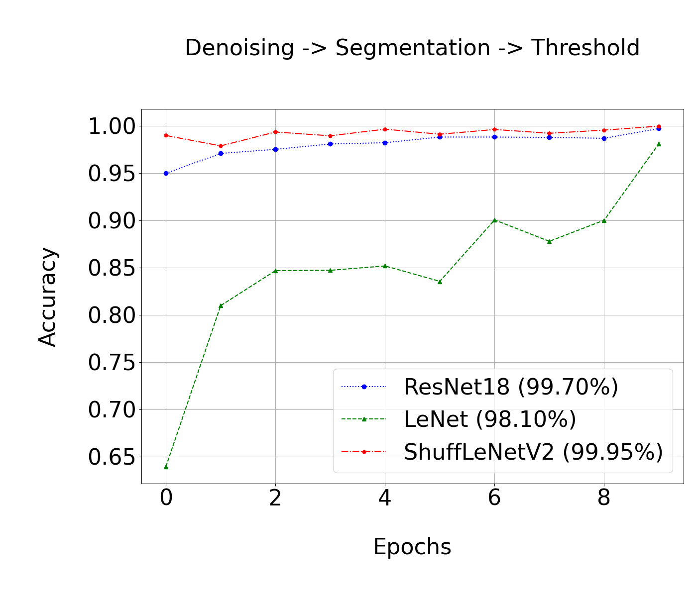

# YSLS-Grad: A machine learning and Grad-Cam-based approach for identifying plant disease from leaves

# Summary

In the 4.0 technology revolution, artificial intelligence is increasingly developed and widely applied in all fields, especially smart agriculture. Development in the agricultural sector, especially crops, is one of the critical areas in economic development. The difficulties in growing fruit trees are the appearance of diseases such as brown spots, leaf cover fire, leaf fungus, powdery mildew, etc., which have reduced the yield and the quality of fruit cultivation. Therefore, detecting common plant leaf diseases is an urgent issue in agricultural development. This study proposes a plant leaf disease detection approach, namely YSLS-Grad, based on machine learning algorithms combined with an Interpretable Machine Learning Model such as Gradient-Weighted Class Activation Map (Grad-CAM). The proposed approach is: First, the You Only Look Once (YOLO) v8 is applied to separate the leaf area from plant images. Then, the Soft threshold-based noise reduction technique, Lasso regression, is used to reduce image noise. Next, the data are fed into the ShuffleNetV2 model refined with hyperparameter values for classifying plant leaf diseases. Then, after obtaining a trained model, Grad-CAM is deployed to locate the disease area on the plant leaf images. Based on essential scores on disease areas computed by Grad-CAM, we compare threshold values to perform the segmentation tasks. 

### The proposed workflow 

The proposed workflow for Disease Detection on Plant Leaves.
Shows the overall workflow for leaf disease detection. In the first phase, we collect data for testing and divide the dataset into two main subsets, including the training and testing sets. We then process data by applying image denoising, Soft Thresholding Noise Filtering with Lasso regression to reduce image noise. Next, the data are fed into deep learning architectures such as ShuffleNetV2, LeNet-5, and ResNet18 for disease classification tasks. After having a classification model, the study continued to apply the Grad-CAM interpretation method, which supports segmentation to locate the disease area on the plant leaf images.

## Method
- YOLOv8, ShuffleNetV2, ResNet18, LeNet-5
- GradCAM
- Noise Reduction

## Experimental Results

- Figure shows the results of the confusion matrix in the testing set, with the number of disease classes that produced the lowest results being the class named Tomato Early Blight with an accuracy of 0.6 and the class that produced the highest result with an accuracy of 1.0.

- Figure compares test recognition accuracy by ShuffleNetV2, ResNet18, and LeNet-5 in modern architectures. With training comparison, it works and corresponds to the validation.

## Technologies Used
Here are some key technologies that our project utilizes:

- [Python](https://www.python.org/)

## Support

If you encounter any issues or have questions, please feel free to contact us via [email](mailto:nphat77777@gmail.com) or [on our](https://github.com/thnguyencit/plant-disease-ml/tree/main).

---
**Note:** Don't forget to update all links and information to reflect the specifics of your project.
